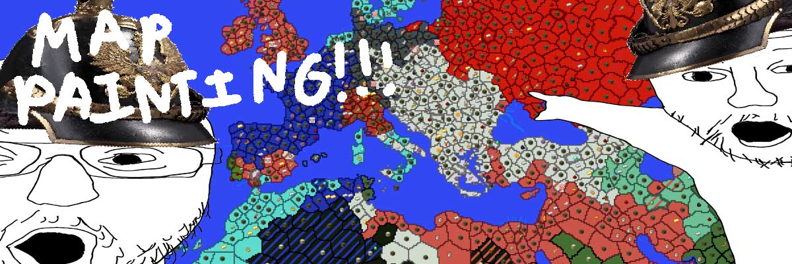

# Minecraft nodes plugin

Map painting but in block game. Contains server plugin and nodes dynmap viewer/editor extension.

**Documentation:** <https://github.com/d-z4/minecraft-nodes/wiki>   
**Editor:** <https://editor.nodes.soy/earth.html>  


# Repo structure
```
minecraft-nodes/
 ├─ nodes/                - Main nodes plugin
 └─ dynmap/               - Dynmap editor/viewer
```


# Build
This repository contains the following separate projects:
1.  Nodes main server plugin
2.  Dynmap viewer/editor


## 1. Building main server plugin
Requirements:
- Java JDK 21 (current plugin target java version)

Go inside `nodes/` and run
```
./gradlew build
```
Built `nodes-VERSION.jar` will appear in `build/libs/`.

To build without kotlin shaded into the jar (e.g. if using separate kotlin
runtime plugin for example my <https://github.com/d-z4/minecraft-kotlin>),
run with following:
```
./gradlew build -P no-kotlin
```

-----------------------------------------------------------

## 2. Building dynmap viewer/editor
*See internal folder `dynmap/README.md` for more details*

Requirements:
- node.js
- Rust

-----------------------------------------------------------

## 3. Building ports plugin
Requirements:
- Java JDK 21 (current plugin target java version)

### 1. Build ports plugin `nodes-ports.jar`:
Go inside `ports/` and run
```
./gradlew build
```
Built `.jar` will appear in `build/libs/nodes-ports-*.jar`.


# Issues/Todo
See [TODO.md](./TODO.md) for current high-level todo list.


# License
Licensed under [GNU GPLv3](https://www.gnu.org/licenses/gpl-3.0.en.html).
See [LICENSE.md](./LICENSE.md).


# Acknowledgements
Special thanks to early contributors:
- **phonon**: making the original plugin
- **Jonathan**: coding + map painting
- **Doneions**: coding + testing + lole
